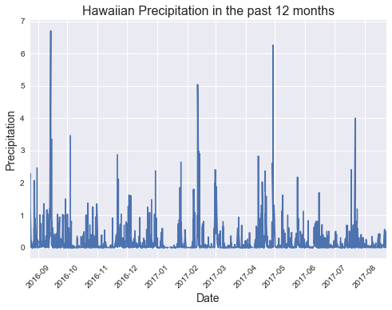
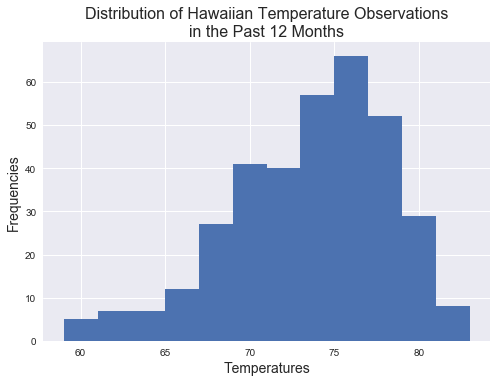
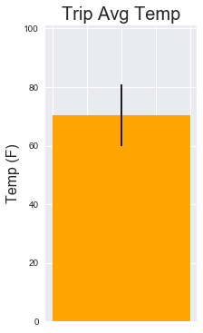

```python
import sqlalchemy
from sqlalchemy.ext.automap import automap_base
from sqlalchemy.orm import Session
from sqlalchemy import create_engine
from sqlalchemy import func
from datetime import datetime
import pandas as pd
import seaborn as sns
from matplotlib import pyplot as plt
```


```python
# Connect to db
engine = create_engine("sqlite:///hawaii.sqlite", echo=False)
```


```python
# Reflect tables into classes
Base = automap_base()
Base.prepare(engine, reflect=True)
Base.classes.keys()
```


    ['meas', 'sta']


```python
# Save references to classes
Stations = Base.classes.sta
Measurements = Base.classes.meas
```


```python
# Create db session object
session = Session(engine)
```

## Precipitation Analysis


```python
# Design a query to retrieve the last 12 months of precipitation data.
# Select only the date and prcp values

last12 = datetime.strptime("8/23/2016", "%m/%d/%Y")

precip_query = (session.query(Measurements.date, Measurements.prcp).
          filter(Measurements.date > last12))
```


```python
# Load the query results into a Pandas DataFrame and set the index to the date column.

dates = []
precips = []

for row in precip_query:
    dates.append(row[0])
    precips.append(row[1])

precip_df = pd.DataFrame({"Date": dates,
                          "Precipitation": precips}).set_index("Date")
```


```python
#Plot the results using the DataFrame plot method.

plt.clf()
precip_df.plot(legend = False)
plt.ylabel("Precipitation", size = 14)
plt.xlabel("Date", size = 14)
plt.title("Hawaiian Precipitation in the past 12 months",
         size = 16)
plt.xticks(rotation = 45)
plt.show()
```


    <matplotlib.figure.Figure at 0x1e70faf6780>





```python
# Use Pandas to print the summary statistics for the precipitation data.
 
precip_df.describe()
```


<div>
<style>
    .dataframe thead tr:only-child th {
        text-align: right;
    }

    .dataframe thead th {
        text-align: left;
    }

    .dataframe tbody tr th {
        vertical-align: top;
    }
</style>
<table border="1" class="dataframe">
  <thead>
    <tr style="text-align: right;">
      <th></th>
      <th>Precipitation</th>
    </tr>
  </thead>
  <tbody>
    <tr>
      <th>count</th>
      <td>2015.000000</td>
    </tr>
    <tr>
      <th>mean</th>
      <td>0.176462</td>
    </tr>
    <tr>
      <th>std</th>
      <td>0.460288</td>
    </tr>
    <tr>
      <th>min</th>
      <td>0.000000</td>
    </tr>
    <tr>
      <th>25%</th>
      <td>0.000000</td>
    </tr>
    <tr>
      <th>50%</th>
      <td>0.020000</td>
    </tr>
    <tr>
      <th>75%</th>
      <td>0.130000</td>
    </tr>
    <tr>
      <th>max</th>
      <td>6.700000</td>
    </tr>
  </tbody>
</table>
</div>


## Station Analysis


```python
# Design a query to calculate the total number of stations.

tot_sta = (session.query(func.count(Stations.name)).scalar())
print(f"Total number of stations: {tot_sta}")
```

    Total number of stations: 9
    


```python
# Design a query to find the most active stations.

# List the stations and observation counts in descending order
active_sta = (session.query(Measurements.station, func.count(Measurements.tobs))
              .group_by(Measurements.station)
              .order_by(func.count(Measurements.tobs).desc()))

# Which station has the highest number of observations?
print(f"The most active station is {active_sta[0][0]} with {active_sta[0][1]} temperature observations.")
```

    The most active station is USC00519281 with 2772 temperature observations.
    


```python
# Design a query to retrieve the last 12 months of temperature observation data 

last12_temp = (session.query(Measurements.tobs)
               .filter(Measurements.date > last12)
               .filter(Measurements.station == active_sta[0][0]))
```


```python
# Plot the results as a histogram with bins=12.

temps = []
for row in last12_temp:
    temps.append(row[0])
    
plt.clf()
plt.hist(temps, bins = 12)
plt.xlabel("Temperatures", size = 14)
plt.ylabel("Frequencies", size = 14)
plt.title("Distribution of Hawaiian Temperature Observations\nin the Past 12 Months", size = 16)
plt.show()
```





## Temperature Analysis


```python
#Write a function called calc_temps that will accept a
# start date and end date in the format %Y-%m-%d and return
# the minimum, average, and maximum temperatures for that range of dates.

def calc_temps():
    start = datetime.strptime(input("Start date (YYYY-m-d): "), "%Y-%m-%d")
    end = datetime.strptime(input("End date (YYYY-m-d): "), "%Y-%m-%d")
    
    temps = []
    
    temp_query = (session.query(Measurements.tobs)
    .filter(Measurements.date >= start)
    .filter(Measurements.date <= end))

    for row in temp_query:
        temps.append(row[0])
    
    min_temp = min(temps)
    avg_temp = round(sum(temps)/len(temps),1)
    max_temp = max(temps)
    
    err = (max_temp-min_temp)/2
    
    print(f"""
    Min: {min_temp}
    Avg: {avg_temp}
    Max: {max_temp}
    """)
    
    plt.clf()
    plt.bar(1, avg_temp, yerr = err, color = "orange")
    plt.ylabel("Temp (F)", size = 16)
    plt.title("Trip Avg Temp", size = 20)
    plt.ylim(0,101)
    plt.tick_params(axis = "x", bottom = "off", labelbottom = "off")
    plt.figure(figsize=(3,4))
    plt.show()
```


```python
calc_temps()
```

    Start date (YYYY-m-d): 2016-12-21
    End date (YYYY-m-d): 2017-1-24
    
        Min: 60.0
        Avg: 70.4
        Max: 81.0
        
    





    <matplotlib.figure.Figure at 0x1e70fc8b780>

